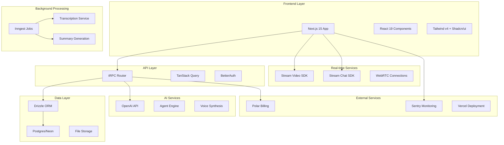

# Design Document

## Overview

Meet AI is a modern SaaS platform built on Next.js 15 with React 19, designed to provide AI-powered video calling experiences. The architecture leverages Stream's real-time SDKs for video and chat, OpenAI for intelligent agent capabilities, and a robust backend infrastructure supporting subscription billing, background processing, and comprehensive meeting analytics.

The system follows a microservices-oriented approach with clear separation between frontend presentation, API layer, real-time communication, AI processing, and background job handling. All components are designed for scalability, reliability, and optimal user experience.

## Architecture

### High-Level Architecture



### System Flow

1. **User Authentication**: BetterAuth handles secure login/registration
2. **Dashboard Access**: tRPC provides type-safe API access with TanStack Query caching
3. **Agent Management**: CRUD operations for AI agent configurations stored in Postgres
4. **Call Initiation**: Stream Video SDK establishes WebRTC connections
5. **AI Integration**: Real-time OpenAI API calls for agent responses and voice synthesis
6. **Recording**: Automatic call recording through Stream's infrastructure
7. **Background Processing**: Inngest triggers post-call transcription and summarization
8. **Data Storage**: Processed content stored in Postgres with searchable indexes

## Components and Interfaces

### Frontend Components

#### Core Layout Components

- **AppLayout**: Main application shell with navigation and user context
- **Dashboard**: Overview of recent calls, agents, and usage metrics
- **Sidebar**: Navigation menu with user profile and subscription status

#### Agent Management Components

- **AgentList**: Grid/list view of user's AI agents with quick actions
- **AgentEditor**: Form interface for creating/editing agent configurations
- **AgentPreview**: Real-time preview of agent personality and capabilities

#### Video Call Components

- **CallInterface**: Main video calling UI with Stream Video SDK integration
- **ParticipantGrid**: Layout manager for video streams (user + AI agent)
- **CallControls**: Mute, camera, screen share, and call termination controls
- **ChatPanel**: Integrated chat interface using Stream Chat SDK

#### Meeting History Components

- **MeetingList**: Chronological list of past meetings with search/filter
- **MeetingDetail**: Full meeting view with transcript, summary, and playback
- **TranscriptSearch**: Advanced search interface with highlighting
- **MeetingAnalytics**: Visual charts and insights from meeting data

### Backend API Structure

#### Authentication Routes

```typescript
// /api/auth/*
interface AuthRoutes {
  signUp: (email: string, password: string) => Promise<User>;
  signIn: (email: string, password: string) => Promise<Session>;
  signOut: () => Promise<void>;
  resetPassword: (email: string) => Promise<void>;
}
```

#### Agent Management Routes

```typescript
// /api/agents/*
interface AgentRoutes {
  create: (config: AgentConfig) => Promise<Agent>;
  update: (id: string, config: Partial<AgentConfig>) => Promise<Agent>;
  delete: (id: string) => Promise<void>;
  list: () => Promise<Agent[]>;
  get: (id: string) => Promise<Agent>;
}
```

#### Call Management Routes

```typescript
// /api/calls/*
interface CallRoutes {
  initiate: (agentId: string) => Promise<CallSession>;
  join: (callId: string) => Promise<StreamToken>;
  end: (callId: string) => Promise<void>;
  getHistory: () => Promise<Call[]>;
  getRecording: (callId: string) => Promise<RecordingUrl>;
}
```

#### Subscription Routes

```typescript
// /api/subscription/*
interface SubscriptionRoutes {
  getPlans: () => Promise<Plan[]>;
  subscribe: (planId: string) => Promise<Subscription>;
  cancel: () => Promise<void>;
  getUsage: () => Promise<UsageMetrics>;
}
```

### Real-time Integration

#### Stream Video SDK Integration

- **Call Setup**: Initialize Stream client with user tokens
- **Agent Participation**: Simulate AI agent as virtual participant
- **Recording Management**: Automatic recording start/stop with metadata
- **Quality Management**: Adaptive bitrate and connection monitoring

#### Stream Chat SDK Integration

- **Channel Creation**: Dedicated chat channel per call session
- **Message Routing**: Route user messages to AI agent processing
- **History Persistence**: Maintain chat logs linked to call records

### AI Agent Engine

#### Agent Configuration

```typescript
interface AgentConfig {
  name: string;
  personality: string;
  knowledgeBase: string[];
  responseStyle: "formal" | "casual" | "technical";
  voiceSettings: VoiceConfig;
  capabilities: AgentCapability[];
}
```

#### Real-time Processing Pipeline

1. **Audio Input**: Capture user speech via WebRTC
2. **Speech-to-Text**: Convert audio to text using OpenAI Whisper
3. **Context Processing**: Combine transcript with agent configuration
4. **Response Generation**: Generate contextual response using GPT-4
5. **Text-to-Speech**: Convert response to audio using OpenAI TTS
6. **Audio Output**: Stream synthesized speech back to call

## Data Models

### User Management

```sql
-- Users table
CREATE TABLE users (
  id UUID PRIMARY KEY DEFAULT gen_random_uuid(),
  email VARCHAR(255) UNIQUE NOT NULL,
  password_hash VARCHAR(255) NOT NULL,
  subscription_id UUID REFERENCES subscriptions(id),
  created_at TIMESTAMP DEFAULT NOW(),
  updated_at TIMESTAMP DEFAULT NOW()
);

-- User sessions
CREATE TABLE user_sessions (
  id UUID PRIMARY KEY DEFAULT gen_random_uuid(),
  user_id UUID REFERENCES users(id) ON DELETE CASCADE,
  token VARCHAR(255) UNIQUE NOT NULL,
  expires_at TIMESTAMP NOT NULL,
  created_at TIMESTAMP DEFAULT NOW()
);
```

### Agent Configuration

```sql
-- AI Agents
CREATE TABLE agents (
  id UUID PRIMARY KEY DEFAULT gen_random_uuid(),
  user_id UUID REFERENCES users(id) ON DELETE CASCADE,
  name VARCHAR(255) NOT NULL,
  personality TEXT NOT NULL,
  knowledge_base JSONB DEFAULT '[]',
  voice_settings JSONB NOT NULL,
  capabilities JSONB DEFAULT '[]',
  is_active BOOLEAN DEFAULT true,
  created_at TIMESTAMP DEFAULT NOW(),
  updated_at TIMESTAMP DEFAULT NOW()
);
```

### Call Management

```sql
-- Call sessions
CREATE TABLE calls (
  id UUID PRIMARY KEY DEFAULT gen_random_uuid(),
  user_id UUID REFERENCES users(id) ON DELETE CASCADE,
  agent_id UUID REFERENCES agents(id) ON DELETE SET NULL,
  stream_call_id VARCHAR(255) UNIQUE NOT NULL,
  status VARCHAR(50) DEFAULT 'active',
  started_at TIMESTAMP DEFAULT NOW(),
  ended_at TIMESTAMP,
  duration_seconds INTEGER,
  recording_url TEXT
);

-- Call transcripts
CREATE TABLE transcripts (
  id UUID PRIMARY KEY DEFAULT gen_random_uuid(),
  call_id UUID REFERENCES calls(id) ON DELETE CASCADE,
  content TEXT NOT NULL,
  summary TEXT,
  key_points JSONB DEFAULT '[]',
  processed_at TIMESTAMP DEFAULT NOW(),
  search_vector tsvector GENERATED ALWAYS AS (to_tsvector('english', content)) STORED
);

-- Create search index
CREATE INDEX idx_transcripts_search ON transcripts USING GIN(search_vector);
```

### Subscription Management

```sql
-- Subscription plans
CREATE TABLE subscription_plans (
  id UUID PRIMARY KEY DEFAULT gen_random_uuid(),
  name VARCHAR(255) NOT NULL,
  price_monthly INTEGER NOT NULL, -- in cents
  call_limit INTEGER,
  storage_limit_gb INTEGER,
  features JSONB DEFAULT '[]',
  is_active BOOLEAN DEFAULT true
);

-- User subscriptions
CREATE TABLE subscriptions (
  id UUID PRIMARY KEY DEFAULT gen_random_uuid(),
  user_id UUID REFERENCES users(id) ON DELETE CASCADE,
  plan_id UUID REFERENCES subscription_plans(id),
  polar_subscription_id VARCHAR(255) UNIQUE,
  status VARCHAR(50) DEFAULT 'active',
  current_period_start TIMESTAMP,
  current_period_end TIMESTAMP,
  created_at TIMESTAMP DEFAULT NOW()
);
```

## Error Handling

### Frontend Error Boundaries

- **Global Error Boundary**: Catches unhandled React errors and displays user-friendly messages
- **Route-specific Boundaries**: Targeted error handling for specific application sections
- **API Error Handling**: Standardized error responses with user-actionable messages

### API Error Standards

```typescript
interface APIError {
  code: string;
  message: string;
  details?: Record<string, any>;
  timestamp: string;
}

// Standard error codes
enum ErrorCodes {
  AUTHENTICATION_FAILED = "AUTH_001",
  INSUFFICIENT_PERMISSIONS = "AUTH_002",
  SUBSCRIPTION_REQUIRED = "SUB_001",
  CALL_LIMIT_EXCEEDED = "SUB_002",
  AGENT_NOT_FOUND = "AGENT_001",
  CALL_CONNECTION_FAILED = "CALL_001",
  TRANSCRIPTION_FAILED = "PROC_001",
}
```

### Real-time Error Recovery

- **Connection Monitoring**: Detect and handle WebRTC connection issues
- **Automatic Reconnection**: Implement exponential backoff for failed connections
- **Graceful Degradation**: Maintain core functionality when non-critical services fail
- **User Notifications**: Clear communication about service status and recovery actions

### Background Job Error Handling

- **Retry Logic**: Exponential backoff for failed transcription/summarization jobs
- **Dead Letter Queue**: Capture permanently failed jobs for manual review
- **Monitoring Integration**: Alert administrators of processing failures via Sentry

## Testing Strategy

### Unit Testing

- **Component Testing**: React Testing Library for UI component behavior
- **API Testing**: Jest for tRPC router and database operations
- **Agent Logic Testing**: Isolated testing of AI agent response generation
- **Utility Testing**: Pure function testing for data transformations

### Integration Testing

- **API Integration**: End-to-end API workflow testing
- **Database Integration**: Test database operations with real Postgres instance
- **Stream SDK Integration**: Mock Stream services for call flow testing
- **Payment Integration**: Test Polar webhook handling and subscription flows

### End-to-End Testing

- **User Workflows**: Playwright tests for complete user journeys
- **Call Scenarios**: Automated testing of video call initiation and management
- **Subscription Flows**: Test signup, upgrade, and billing scenarios
- **Cross-browser Testing**: Ensure compatibility across major browsers

### Performance Testing

- **Load Testing**: Simulate concurrent users and call sessions
- **Database Performance**: Query optimization and index effectiveness
- **Real-time Performance**: WebRTC connection quality under load
- **Background Job Performance**: Transcription processing time benchmarks

### Monitoring and Observability

- **Error Tracking**: Sentry integration for frontend and backend errors
- **Performance Monitoring**: Vercel Analytics for application performance
- **Database Monitoring**: Neon Postgres metrics and query analysis
- **Custom Metrics**: Track business KPIs like call success rate and transcription accuracy
